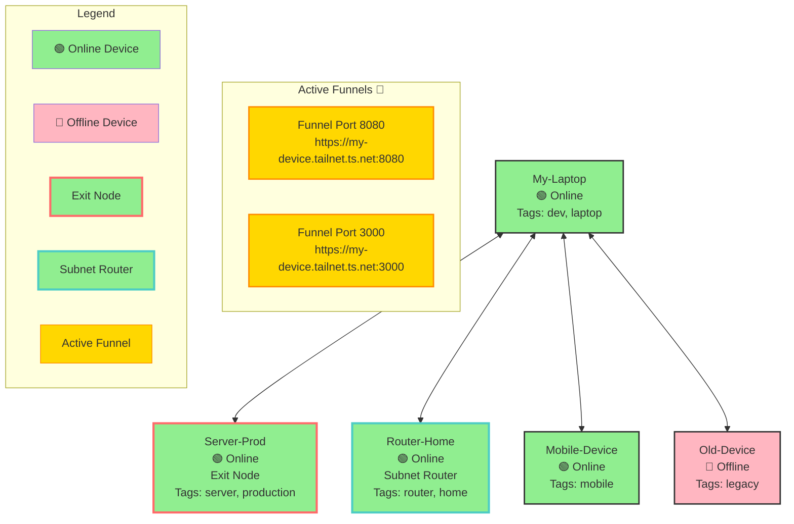

# Tailscale Tailnet Mermaid Diagram Example

This document shows an example of the Mermaid diagram generated by the `tailscale_status` tool when `include_mermaid_diagram=True`.

## Example Output

When you call:
```python
tailscale_status(include_mermaid_diagram=True)
```

The response includes a `mermaid_diagram` field with Mermaid code that can be rendered in Markdown viewers.

## Sample Diagram

Here's what a typical tailnet diagram looks like:



## Visual Elements

### Device Nodes
- **🟢 Green nodes**: Online devices
- **🔴 Pink nodes**: Offline devices
- **Red border**: Exit nodes (devices that can route traffic to the internet)
- **Teal border**: Subnet routers (devices advertising subnet routes)
- **Device labels**: Show name, online/offline status, and tags

### Funnel Nodes
- **Gold nodes**: Active Funnel services
- **Shown in separate subgraph**: "Active Funnels 🔗"
- **Display**: Port number and public URL

### Connections
- **Bidirectional arrows**: Simplified mesh topology showing devices connected to the tailnet
- **Hub pattern**: First device acts as hub (simplified visualization)

### Legend
- **Color-coded examples**: Shows what each color and style means
- **Only shows relevant items**: Exit nodes, subnet routers, and funnels only appear if present

## Usage

### In Claude Desktop
The Mermaid diagram code is returned in the response and can be:
1. Copied to a Markdown file
2. Rendered in Obsidian, GitHub, GitLab, or other Mermaid-compatible viewers
3. Used in documentation

### Example Response Structure
```json
{
  "component": "overview",
  "detail_level": "basic",
  "timestamp": 1732406400.0,
  "status": {
    "system": {...},
    "devices": {...},
    "mermaid_diagram": "graph TB\n    %% Tailnet Topology: 5 devices..."
  }
}
```

## Benefits

1. **Visual Overview**: Quickly see all devices and their status
2. **Network Topology**: Understand device relationships
3. **Funnel Visibility**: See what services are publicly exposed
4. **Status at a Glance**: Color coding makes it easy to spot issues
5. **Documentation**: Great for network documentation and diagrams

## Rendering

The Mermaid diagram can be rendered in:
- **GitHub/GitLab**: Automatically renders in Markdown files
- **Obsidian**: With Mermaid plugin
- **VS Code**: With Mermaid preview extensions
- **Online**: https://mermaid.live/ (paste the code)
- **Documentation**: Any Markdown viewer with Mermaid support

---

**Last Updated**: 2025-11-24

