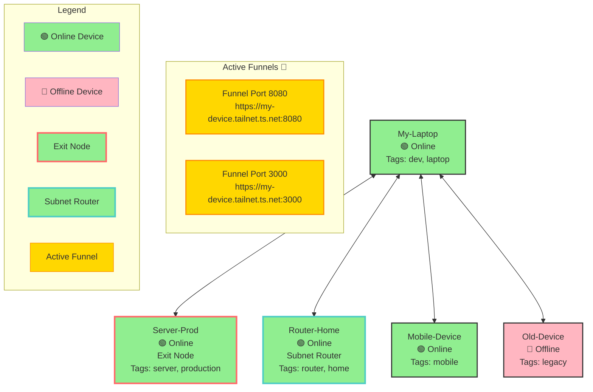

# Sample Tailscale Status Response with Mermaid Diagram

This is what the response would look like when you call:
```python
tailscale_status(include_mermaid_diagram=True)
```

## Sample Response Structure

```json
{
  "component": "overview",
  "detail_level": "basic",
  "timestamp": 1732406400.0,
  "status": {
    "system": {
      "status": "operational",
      "version": "2.0.0",
      "uptime": "Running",
      "last_updated": 1732406400.0
    },
    "devices": {
      "total": 5,
      "online": 4,
      "offline": 1,
      "online_percentage": 80.0
    },
    "network": {
      "connectivity": "good",
      "latency": "15ms",
      "bandwidth": "100 Mbps",
      "health_score": 95
    },
    "mcp_server": {
      "tools": {
        "count": 13,
        "names": [
          "tailscale_device",
          "tailscale_network",
          "tailscale_monitor",
          "tailscale_file",
          "tailscale_funnel",
          "tailscale_security",
          "tailscale_automation",
          "tailscale_backup",
          "tailscale_performance",
          "tailscale_reporting",
          "tailscale_integration",
          "tailscale_help",
          "tailscale_status"
        ]
      },
      "prompts": {
        "count": 3
      },
      "resources": {
        "count": 5
      }
    },
    "health": {
      "overall": "healthy",
      "devices": "healthy",
      "network": "healthy",
      "services": "healthy",
      "mcp_server": "healthy"
    },
    "mermaid_diagram": "graph TB\n    %% Tailnet Topology: 5 devices (4 online, 1 exit nodes, 1 subnet routers, 2 active funnels)\n    dev0[\"My-Laptop\\n🟢 Online\\nTags: dev, laptop\"]\n    style dev0 fill:#90EE90,stroke:#333,stroke-width:2px\n    dev1[\"Server-Prod\\n🟢 Online\\nExit Node\\nTags: server, production\"]\n    style dev1 fill:#90EE90,stroke:#FF6B6B,stroke-width:3px\n    dev2[\"Router-Home\\n🟢 Online\\nSubnet Router\\nTags: router, home\"]\n    style dev2 fill:#90EE90,stroke:#4ECDC4,stroke-width:3px\n    dev3[\"Mobile-Device\\n🟢 Online\\nTags: mobile\"]\n    style dev3 fill:#90EE90,stroke:#333,stroke-width:2px\n    dev4[\"Old-Device\\n🔴 Offline\\nTags: legacy\"]\n    style dev4 fill:#FFB6C1,stroke:#333,stroke-width:2px\n    subgraph Funnels[Active Funnels 🔗]\n    funnel8080[\"Funnel Port 8080\\nhttps://my-device.tailnet.ts.net:8080\"]\n    style funnel8080 fill:#FFD700,stroke:#FF8C00,stroke-width:2px\n    funnel3000[\"Funnel Port 3000\\nhttps://my-device.tailnet.ts.net:3000\"]\n    style funnel3000 fill:#FFD700,stroke:#FF8C00,stroke-width:2px\n    end\n    dev0 <--> dev1\n    dev0 <--> dev2\n    dev0 <--> dev3\n    dev0 <--> dev4\n    subgraph Legend[Legend]\n    Online[\"🟢 Online Device\"]\n    Offline[\"🔴 Offline Device\"]\n    Exit[\"Exit Node\"]\n    Subnet[\"Subnet Router\"]\n    Funnel[\"Active Funnel\"]\n    style Online fill:#90EE90\n    style Offline fill:#FFB6C1\n    style Exit fill:#90EE90,stroke:#FF6B6B,stroke-width:3px\n    style Subnet fill:#90EE90,stroke:#4ECDC4,stroke-width:3px\n    style Funnel fill:#FFD700,stroke:#FF8C00\n    end"
  }
}
```

## The Mermaid Diagram (Rendered)

Here's what the diagram code would render as:



## How to Use

1. **Call the tool in Claude Desktop:**
   ```
   tailscale_status(include_mermaid_diagram=True)
   ```

2. **Extract the diagram:**
   - Look for `status.mermaid_diagram` in the response
   - Copy the Mermaid code

3. **View it:**
   - Paste into https://mermaid.live/
   - Or save to a `.md` file and view in GitHub/GitLab
   - Or use a Markdown preview extension

## What the Diagram Shows

- **🟢 Green nodes**: Online devices (4 devices)
- **🔴 Pink nodes**: Offline devices (1 device)
- **Red border**: Exit node (Server-Prod)
- **Teal border**: Subnet router (Router-Home)
- **Gold nodes**: Active Funnels (2 funnels on ports 8080 and 3000)
- **Connections**: Simplified mesh topology
- **Legend**: Explains all colors and styles

---

**Note**: This is a sample response. Your actual response will reflect your real tailnet devices, status, and active funnels.

